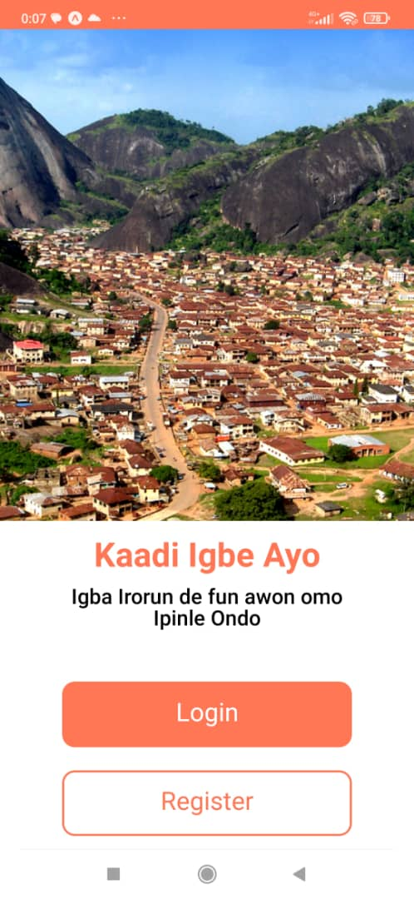
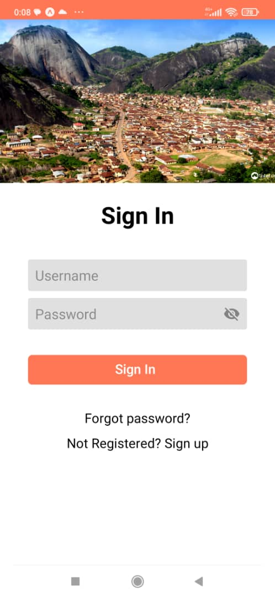

# Kaadi App

> Kaadi App is React Native mobile application  used to register and provide social welfare interventions for residents of Ondo State.  Residents can register for Kaadi Igbeayo. Verified Residents of Ondo State can login into the app using their ORIN number and have access to all the social interventions they have accessed using the residency card.

## Mini Demo:

## Built With

- React Native
- Redux
- JavaScript
- Jest

## Getting Started

To get a local copy up and running follow these simple example steps.

### Prerequisites
- A text editor(preferably Visual Studio Code)
- Node
- Web browser

